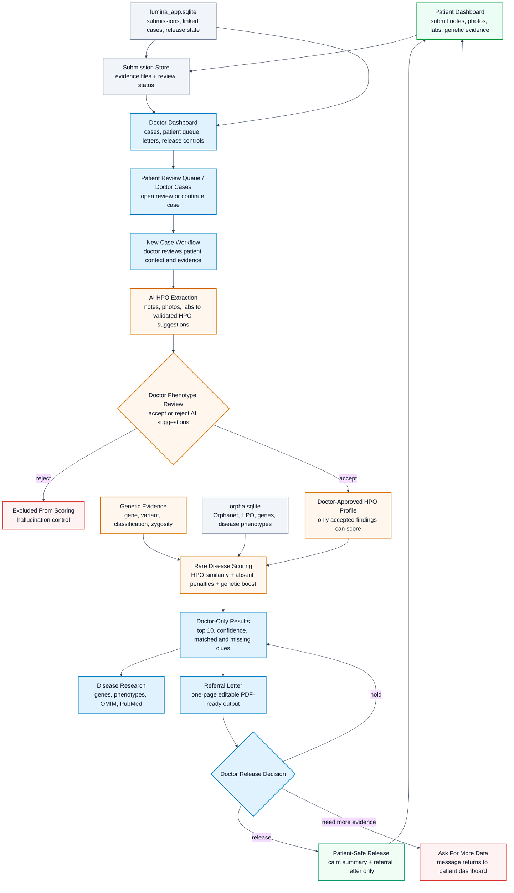

<div align="center">

# Lumina

**Doctor-reviewed rare disease triage, phenotype scoring, and patient-safe referral generation**

> AWS migration repository: this private `lumina-aws` baseline is being prepared for a phased AWS-native SaaS rebuild. The target region is `us-east-1`, the cost posture is resume-demo/free-tier conscious, and Bedrock stays disabled by default until the AI provider migration phase.

[](https://lumina-sandy-two.vercel.app)
[](https://veees-lumina-api.hf.space)
[](#localization)
[](#)

</div>

---

## AWS Migration Status

This repository is the clean baseline for moving Lumina from its current Clerk/Vercel/Hugging Face/Groq/local SQLite shape to an AWS-native SaaS architecture.

Phase 1 is intentionally limited to repository setup, metadata, baseline validation, and migration tracking. Cognito, static export, DynamoDB, S3 uploads, SQS workers, Bedrock, Terraform, and AWS deployment are handled in later phases.

See [docs/aws-migration.md](docs/aws-migration.md) for the phase tracker.

---

## Demo

<div align="center">

[](https://www.youtube.com/watch?v=YgJhmPjaISU&list=PLBJY-JMgw8DFo7sA4YsWJLoFp36wbLUJa&index=5)

**Click the preview to watch the Lumina demo.**

</div>

---

## What Is Lumina?

Lumina is a clinical decision-support prototype for rare disease diagnosis. It helps doctors convert scattered patient evidence into reviewed Human Phenotype Ontology (HPO) findings, rank possible rare diseases against Orphanet/HPO knowledge, and generate a polished one-page referral letter.

Lumina is built around a strict **doctor-in-the-loop** principle:

- AI can suggest clinical phenotypes.
- The doctor must accept or reject each suggested phenotype.
- Rejected and pending findings are excluded from scoring.
- Genetic evidence is reviewed separately and carries strong diagnostic weight when it supports a disease.
- The full technical scorecard stays doctor-facing by default.
- Patients receive a calm, doctor-approved summary and referral letter, not raw disease rankings or confidence tables.

Lumina is **not a medical device** and does not replace clinical judgment. It is a research/prototype system designed to make rare disease triage faster, more structured, and more explainable.

---

## Why Lumina Exists

Rare disease diagnosis is difficult because the useful clues are usually scattered across years of clinical notes, lab reports, visible physical findings, genetic reports, and specialist letters. There are more than 7,000 known rare diseases, and no doctor can memorize every phenotype pattern, gene association, inheritance pattern, and confirmatory workup.

In a real clinic, a doctor needs a system that can:

- capture patient evidence quickly,
- extract likely HPO phenotype findings,
- reduce AI hallucination through doctor approval,
- score rare disease candidates using reviewed evidence only,
- show why each disease was ranked,
- highlight missing and distinguishing findings,
- preserve patient safety by hiding raw scorecards from patients,
- create a referral letter that another specialist can act on.

Lumina was built around that workflow.

---

## Core Workflow

1. A patient or clinic staff member submits clinical notes, photos, lab reports, and genetic evidence.
2. The submission appears in the doctor-facing patient review queue.
3. The doctor opens the submission and reviews patient context.
4. Lumina suggests HPO phenotype terms from text, photo, and lab evidence.
5. The doctor accepts correct phenotypes and rejects incorrect ones.
6. Accepted phenotypes and reviewed genetic evidence are passed to the scoring engine.
7. Lumina returns the top rare disease differentials with explainability.
8. The doctor reviews supporting findings, missing findings, and distinguishing clues.
9. The doctor generates and edits a one-page referral letter.
10. The doctor explicitly releases a patient-safe summary and referral letter to the patient dashboard.

The patient dashboard is intentionally limited. Lumina was originally designed for doctors using the tool while the patient is physically present in the clinic. The patient-side workflow solves the remote pre-intake and report-release requirement without giving patients unrestricted access to technical rare disease rankings that may confuse or frighten them.

---

## Product Surface

### Doctor Dashboard

The doctor dashboard is the main workspace. It gives clinicians fast access to:

- saved cases,
- new case intake,
- patient review queue,
- pending submissions,
- released letters,
- case search by patient, date, diagnosis, or case ID.

### Patient Review Queue

Patients can submit evidence before or between appointments. Those submissions are stored server-side and shown in the doctor queue with clear status tracking:

- `doctor_review_pending`: submitted and waiting for review,
- `in_review`: opened by a doctor,
- `needs_more_data`: doctor requested more evidence,
- `doctor_completed`: analysis exists but has not been released,
- `released_to_patient`: patient can see the approved summary and referral letter.

Doctors can review a submission, ask for more data, run the diagnostic workflow, and release only the safe output.

### Clinical Intake

The intake workspace supports:

- patient context,
- clinical notes,
- voice input,
- quick present/absent symptom chips,
- clinical photo upload,
- lab report upload,
- manual genetic evidence entry,
- AI-suggested HPO terms,
- doctor accept/reject review controls,
- final differential diagnosis.

### Disease Catalog

Each disease page gives doctors a compact clinical reference:

- disease name and ORPHA code,
- inheritance, onset, prevalence, and confirmatory workup where available,
- phenotypes and frequency,
- associated genes,
- OMIM and ICD codes,
- PubMed references,
- an **Analyze this disease** action that opens trusted medical sources such as OMIM or PubMed.

PubMed references are published medical papers linked to the disease. They help doctors verify the condition with real research instead of relying only on AI output.

### Results Page

The doctor-facing results page shows:

- top 10 differential diagnoses,
- evidence-strength confidence,
- matched HPO findings,
- missing expected findings,
- distinguishing clues between close candidates,
- absent findings that reduce confidence,
- genetic support level,
- HPO provenance,
- PubMed references for the top diagnosis,
- editable referral letter,
- patient release controls for linked submissions.

### Patient Dashboard

The patient dashboard shows:

- submitted evidence status,
- doctor request messages,
- whether more data is needed,
- whether a referral is ready,
- released patient-safe summary,
- released referral letter,
- print/download controls for the referral letter.

Patients do **not** see the full technical differential diagnosis by default.

### Referral Letter

The referral letter is the main clinical artifact. Lumina generates a one-page, doctor-editable referral letter containing:

- patient details,
- doctor profile and signature,
- urgency or visit recommendation,
- key accepted findings,
- genetic context,
- top differential diagnoses,
- recommended next steps.

The doctor can edit, print, download as PDF, and release the finalized letter to the patient dashboard.

Example generated referral letter:

[View the sample referral letter PDF](docs/assets/referral-letter-example.pdf)

---

## Technical Architecture



---

## How Scoring Works

Lumina does not ask an LLM to directly choose the final diagnosis. The LLM can help extract candidate phenotypes, but the final ranking is deterministic and evidence-driven.

The scoring flow:

1. AI extraction suggests HPO findings from clinical evidence.
2. Returned HPO IDs are validated against local HPO data.
3. The doctor accepts or rejects each phenotype.
4. Only accepted findings are scored.
5. Present findings increase support for diseases linked to similar phenotypes.
6. Absent findings penalize diseases where those findings are expected.
7. Pathogenic or likely pathogenic genetic evidence gives strong extra support to diseases linked to that gene.
8. The backend returns ranked differential diagnoses with contributing, missing, and distinguishing findings.

The phenotype matching uses HPO ontology structure:

- **Lin similarity** when information content is available,
- **Resnik-style most informative common ancestor** as part of Lin similarity,
- **Jaccard similarity over ancestor sets** as a fallback,
- Orphanet phenotype frequency weights,
- absent-finding penalties,
- genetic support calibration.

This makes Lumina more explainable than a pure chatbot answer. A doctor can see which phenotypes drove each result and what findings are still missing.

---

## Implemented Features

### Evidence Extraction

- Clinical note HPO suggestion.
- Clinical photo HPO suggestion.
- Lab report HPO suggestion.
- OCR/PDF/image handling for lab evidence.
- HPO validation against local ontology data.
- Source/provenance tracking for extracted findings.
- Fallback matching when model extraction fails.

### Doctor Review

- Pending, accepted, and rejected phenotype states.
- Present and absent finding support.
- Doctor approval required before scoring.
- Rejected and pending findings excluded from final ranking.
- This review step is explicitly designed to reduce AI hallucination risk.

### Genetic Evidence

- Manual gene and variant entry from a real clinical/genetic report.
- Classification support for pathogenic, likely pathogenic, VUS, benign, and unknown.
- Strong scoring support for pathogenic or likely pathogenic gene-disease matches.
- Weak or limited support for uncertain evidence.
- Genetic evidence never replaces doctor interpretation; it changes ranking weight.

### Rare Disease Results

- Top 10 differential diagnosis ranking.
- Evidence-strength confidence.
- Phenotype match score.
- Genetic support score.
- Contributing HPO findings.
- Missing expected findings.
- Distinguishing features between close candidates.
- Discordant absent findings.
- Deterministic result behavior for reviewed inputs.

### Case Management

- Doctor cases page.
- Search by patient, diagnosis, date, and case ID.
- Delete cases.
- Original input shown on case page.
- Add more evidence to an existing case.
- Persisted linked cases through the backend app database.

### Patient Workflow

- Patient dashboard.
- Patient evidence submission.
- Patient submissions page.
- Patient reports page.
- Doctor messages requesting more data.
- Per-submission status tracking.
- Delete submissions and linked release data.
- Patient-safe released reports only.

### Referral And Release

- One-page referral letter generation.
- Editable letter draft.
- Doctor profile and signature support.
- Urgency and visit recommendation.
- Print-ready letter preview.
- PDF download.
- Release summary and referral letter to patient.
- Full technical scorecard remains doctor-only by default.

### Disease Research

- Disease detail pages.
- Phenotype list with frequencies.
- Gene list.
- Prevalence, onset, inheritance, and workup fields where available.
- OMIM and ICD codes.
- PubMed references.
- External trusted-source analysis links.

### Localization

Lumina supports 7 languages:

- English,
- Hindi,
- German,
- French,
- Spanish,
- Chinese,
- Japanese.

UI text, navigation, patient/doctor flows, release states, and referral-letter controls are localized. HPO labels are localized where reliable official HPO translations exist; otherwise they fall back to English.

---

## Backend Data And Persistence

Lumina uses two database layers:

- `data/orpha.sqlite`: rare disease knowledge data built from Orphanet/HPO-related assets.
- `data/lumina_app.sqlite`: application data for submissions, uploaded evidence metadata, linked clinical cases, doctor messages, patient-safe summaries, released letters, and release state.

Uploaded evidence files are stored on the API server filesystem under the app data directory and referenced through database metadata.

---

## Repository Map

```text
apps/
  web/
    Next.js frontend
    Doctor dashboard, patient dashboard, queue, intake, results,
    disease catalog, referral letter UI, i18n messages

  api/
    FastAPI backend
    Extraction, scoring, disease details, submissions,
    cases, release flow, referral letters, PDF generation

packages/
  extractors/
    HPO extraction, validation, OCR/model fallbacks

  scoring/
    Disease ranking, HPO similarity, genetic weighting,
    missing/distinguishing findings

  ingest/
    Orphanet/HPO/ClinVar data ingestion and database build scripts

  schemas/
    Shared schema definitions

data/
  orpha.sqlite
    Rare disease phenotype/gene graph

  lumina_app.sqlite
    Runtime app persistence database
```

---

## Tech Stack

| Area | Technology |
| --- | --- |
| Frontend | Next.js, React, TypeScript, Tailwind CSS |
| UI | Custom clinical UI with shadcn-style primitives |
| Auth | Clerk |
| Backend | FastAPI, Python |
| App persistence | SQLModel + SQLite |
| AI extraction | Groq-hosted Llama models |
| OCR/PDF | pytesseract, Pillow, pypdf |
| Scoring | Deterministic HPO/Orphanet evidence scoring |
| Similarity | Lin, Resnik/MICA, Jaccard ancestor-set fallback |
| Data | Orphanet, HPO, ClinVar, FGDD-derived assets |
| Frontend deployment | Vercel |
| API deployment | Hugging Face Spaces |

---

## Local Development

Install dependencies:

```bash
pnpm install
```

Run the frontend:

```bash
cd apps/web
pnpm dev
```

Run the API:

```bash
cd apps/api
uv sync
uv run uvicorn main:app --reload
```

Useful checks:

```bash
pnpm --filter web typecheck
pnpm --filter web lint
cd apps/api && uv run ruff check .
```

Build local disease data:

```bash
cd packages/ingest
uv run python run.py
```

---

## Deployment Rules

- Deploy the frontend to Vercel.
- Deploy only `apps/api` and `packages/` to Hugging Face Spaces.
- Do not deploy the full monorepo to Hugging Face.
- Do not commit patient demo files, credentials, tokens, or private clinical data.
- Update Hugging Face by manually cloning the Space, copying `apps/api` and `packages/`, then pushing from the Space repo.
- Do not use `git subtree` or cross-branch checkout workflows for Hugging Face deployment.

---

## Current Limitations

Lumina is still a prototype:

- It is not clinically certified.
- It has not been validated on a large prospective clinical dataset.
- AI extraction quality depends on input quality, OCR quality, and model behavior.
- The doctor must review all suggested phenotypes before scoring.
- Disease names are not fully localized.
- Some HPO translations fall back to English where reliable translations are unavailable.
- Clinical deployment would require audit logs, access controls, validation studies, and regulatory review.

---

## Roadmap

Short-term engineering:

- Add automated end-to-end browser tests for the full doctor/patient flow.
- Expand API tests for submission, release, scoring, and PDF generation.
- Improve file upload status and OCR failure recovery.
- Add audit history for accepted/rejected phenotypes.
- Add stronger locale key parity checks.

Clinical/product:

- Compare rankings against confirmed diagnoses.
- Improve disease page clinical action summaries.
- Improve genetic evidence weighting with stronger curated mappings.
- Add structured follow-up recommendations.
- Add institution-level referral templates.

Research/data:

- Expand validated HPO matching.
- Improve multilingual HPO terminology.
- Add benchmark datasets for rare disease triage.
- Improve missing-finding recommendations.

---

## Project Status

Lumina currently demonstrates a full prototype workflow:

```text
patient or doctor evidence
  -> AI HPO suggestions
  -> doctor phenotype approval
  -> reviewed genetic evidence
  -> deterministic rare disease scoring
  -> explainable doctor-facing differential
  -> one-page referral letter
  -> patient-safe release
```

The core idea is simple: give doctors the computational power to search rare disease space, but keep clinical authority with the doctor and keep patient-facing output safe, calm, and useful.
