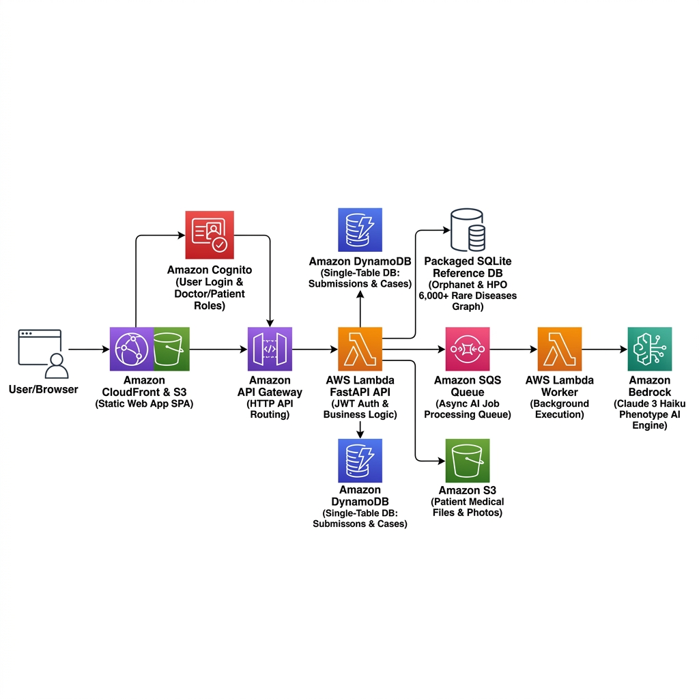

<div align="center">

# Lumina AWS

**Doctor-reviewed rare disease triage, phenotype scoring, and patient-safe referral generation on an AWS-native serverless architecture.**

[](https://d124bi3e327i7a.cloudfront.net/en)
[](https://twfg22gs48.execute-api.us-east-1.amazonaws.com/health)
[](docs/aws-architecture.md)
[](#local-development)
[](#how-lumina-works)

</div>

---

## Live Deployed Endpoints

| Component | Live Deployed Endpoint |
| :--- | :--- |
| **Web SPA Application** | [https://d124bi3e327i7a.cloudfront.net/en](https://d124bi3e327i7a.cloudfront.net/en) |
| **API Gateway Backend** | [https://twfg22gs48.execute-api.us-east-1.amazonaws.com/health](https://twfg22gs48.execute-api.us-east-1.amazonaws.com/health) |
| **Cognito Hosted UI Auth** | `https://lumina-app-prod-auth.auth.us-east-1.amazoncognito.com` |
| **AWS Region** | `us-east-1` |

---

## AWS Enterprise Architecture

<div align="center">



</div>

### Component & Dataset Responsibility Breakdown

| Service / Asset | Lumina Application Role & Location |
| :--- | :--- |
| **Amazon CloudFront & S3** | **Static Web SPA Hosting**: Serves static HTML/JS/CSS export bundle globally (`apps/web/out`). |
| **Amazon Cognito** | **User Login & Role Enforcement**: Manages sign-in/sign-up and issues RS256 JWT tokens (`doctor` & `patient` groups). |
| **Amazon API Gateway** | **HTTP API Gateway**: Handles CORS, routing, and forwards Bearer tokens to Lambda. |
| **AWS Lambda (FastAPI API)** | **Backend Business Logic**: Verifies JWT claims, executes submission CRUD, case linking, and referral releases. |
| **Amazon DynamoDB** | **Single-Table Application Database**: Stores Submissions, Cases, Message History, and User Profiles (`PK`, `SK`, `GSI1`, `GSI2`). |
| **Amazon S3 (Uploads Bucket)** | **Private Encrypted Medical Storage**: Stores patient photos and lab PDFs accessed via short-lived Presigned URLs. |
| **Packaged SQLite Reference DB** | **Orphanet & HPO Medical Knowledge Graph**: Bundled read-only database (`orpha.sqlite`) containing 6,000+ rare disease profiles, HPO phenotype associations, and gene relationships directly inside the Lambda execution environment. |
| **Amazon SQS Jobs Queue** | **Async AI Processing Queue**: Decouples heavy AI document processing and scoring tasks. |
| **AWS Lambda Worker** | **Background Execution**: Consumes SQS records, invokes Bedrock AI, validates HPO IDs against local HPO graph, and writes results to DynamoDB. |
| **Amazon Bedrock** | **GenAI Extraction Engine**: Runs Claude 3 Haiku / Nova Micro for structured phenotype extraction with $0 default `DEMO` fallback. |

---

## How Lumina Works

Lumina is a clinical decision-support platform for rare disease diagnosis designed around a strict **doctor-in-the-loop** safety model.

### 👤 Patient Dashboard Usecase
- **Remote Pre-Intake**: Patients log in via Cognito and submit clinical notes, medical photos, lab PDFs, or genetic variant files.
- **Direct S3 Uploads**: Files bypass application servers and write directly to encrypted private S3 storage via short-lived presigned URLs.
- **Status Tracking & Safe Release**: Patients track submission status (`doctor_review_pending` -> `in_review` -> `released_to_patient`). To prevent panic or confusion, patients **never see raw technical scorecards**—they receive calm, doctor-approved plain-language summaries and recommended specialist visit guides.

### 🩺 Doctor Dashboard Usecase
- **Review Queue**: Clinicians review pending submissions in the patient queue.
- **Phenotype Approval Controls**: Lumina extracts suggested Human Phenotype Ontology (HPO) terms (e.g. `HP:0001250 Seizures`). The doctor must **accept or reject** each suggested phenotype. Rejected/pending terms are strictly excluded to prevent AI hallucinations.
- **Deterministic Rare Disease Scoring**: Approved HPO findings and genetic evidence are scored against 6,000+ diseases using Lin & Resnik ontology similarity algorithms over Orphanet knowledge.
- **Referral Letter Generation & Release**: Lumina generates a doctor-editable one-page referral letter for medical genetics specialists. Once verified, the doctor releases the report to the patient portal.

---

## $0 / Month AWS Free Tier & AI Modes

This architecture is optimized for **$0.00 / month** portfolio and demo deployment:

- **Free Tier Components**: Amazon Cognito (50k MAUs), CloudFront (1 TB transfer), S3 (5 GB), API Gateway (1M calls), Lambda (1M calls), DynamoDB (25 GB), SQS (1M calls).
- **AI Provider Switch (`LUMINA_AI_PROVIDER`)**:
  - `demo` *(Default — $0.00 Cost)*: Uses local HPO dictionary matching ($0 API spend).
  - `bedrock`: Invokes real Amazon Bedrock Claude 3 Haiku / Nova Micro (~$0.00025 per 1,000 tokens).
- **Cost Guardrails**: 7-day CloudWatch log retention and an automated **$5.00 / month AWS Budget alert**.

---

## Local Development

```bash
# Install dependencies
pnpm install

# Run Web SPA locally (http://localhost:3000/en)
cd apps/web && pnpm dev

# Run FastAPI API locally
cd apps/api && uv sync && uv run uvicorn main:app --reload

# Execute tests & linters
cd apps/api && uv run pytest
pnpm --filter web lint && pnpm --filter web typecheck
```

---

## Disclaimer

Lumina is a research prototype for clinical decision support. It is **not a medical device** and does not provide automated diagnostic advice. All clinical decisions must be made by qualified healthcare professionals.
