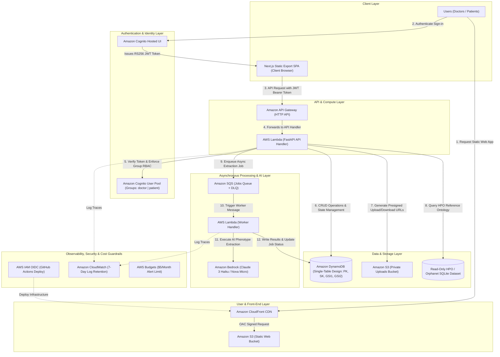
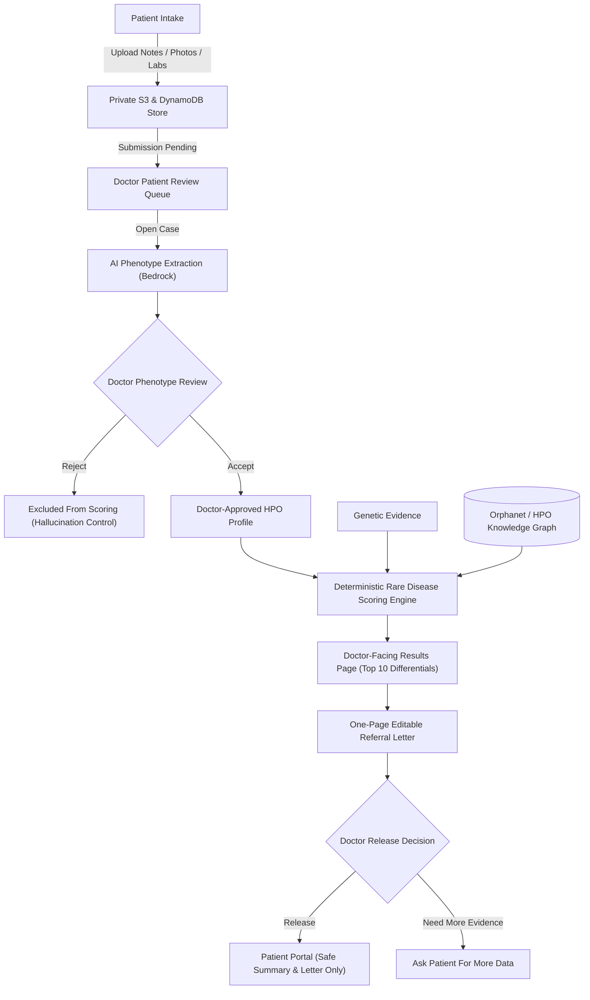
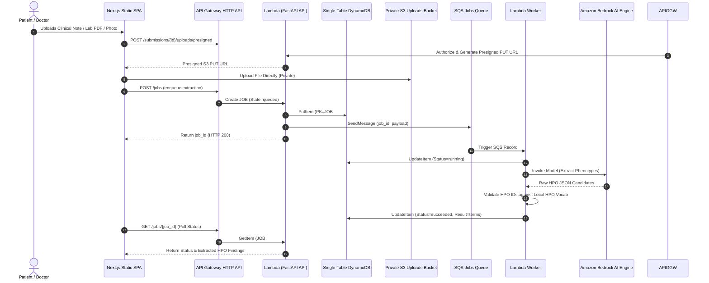

<div align="center">

# Lumina AWS

**Doctor-reviewed rare disease triage, phenotype scoring, and patient-safe referral generation on an AWS-native serverless architecture.**

[](https://d124bi3e327i7a.cloudfront.net/en)
[](https://twfg22gs48.execute-api.us-east-1.amazonaws.com/health)
[](docs/aws-architecture.md)
[](#infrastructure--terraform)
[](#security--authentication)

</div>

---

## Live AWS Deployment Endpoints

| Component | Live Deployed Endpoint |
| :--- | :--- |
| **Web SPA Application** | [https://d124bi3e327i7a.cloudfront.net/en](https://d124bi3e327i7a.cloudfront.net/en) |
| **API Gateway Backend** | [https://twfg22gs48.execute-api.us-east-1.amazonaws.com/health](https://twfg22gs48.execute-api.us-east-1.amazonaws.com/health) |
| **Cognito Hosted UI Auth** | `https://lumina-app-prod-auth.auth.us-east-1.amazoncognito.com` |
| **AWS Region** | `us-east-1` |

---

## AWS Enterprise Architecture



For complete technical specifications, see [docs/aws-architecture.md](docs/aws-architecture.md).

---

## Migration Status & Phased Roadmap

This repository tracks the complete, phased migration of Lumina into an AWS-native serverless SaaS architecture.

| Phase | Milestone | AWS Infrastructure / Feature Implemented | Status |
| :---: | :--- | :--- | :---: |
| **Phase 1** | Baseline Cleanup | Clean repo initialization under `vees-1/lumina-aws`. | **Complete** |
| **Phase 2** | Static Web Export | Next.js static export SPA (`apps/web/out`) for CloudFront + S3 static hosting. | **Complete** |
| **Phase 3** | Cognito Auth | Amazon Cognito Hosted UI integration, JWT RS256 signature validation, and RBAC (`doctor` / `patient`). | **Complete** |
| **Phase 4** | AWS Persistence | Single-table DynamoDB (`lumina-app`) and private S3 file upload pipeline with presigned URLs. | **Complete** |
| **Phase 5** | Async AI Jobs | SQS-backed background job queue, Lambda worker, Bedrock runtime adapter, and HPO validation. | **Complete** |
| **Phase 6** | Terraform & CI/CD | Modular Terraform (`infra/terraform`), GitHub Actions OIDC deploy workflow, and $5/mo cost alert. | **Complete** |

See [docs/aws-migration.md](docs/aws-migration.md) for full phase logs.

---

## Functional Workflows & Flowcharts

### 1. Doctor-in-the-Loop Clinical Triage Flow

Lumina enforces a strict **doctor-in-the-loop** principle: AI extracts candidate phenotypes, but only doctor-accepted Human Phenotype Ontology (HPO) findings are passed to the deterministic scoring engine.



---

### 2. Asynchronous AI Extraction & Disease Scoring Pipeline



---

## What Is Lumina?

Lumina is a clinical decision-support platform for rare disease diagnosis. It helps clinicians convert scattered patient evidence (clinical notes, facial photographs, lab PDFs, and genetic reports) into structured, doctor-reviewed Human Phenotype Ontology (HPO) findings, score candidate rare diseases against Orphanet/HPO knowledge, and generate a polished one-page referral letter.

### Key Principles

- **AI Suggests, Doctor Decides**: AI provides phenotype candidates; clinicians accept or reject each finding.
- **Hallucination Control**: Rejected and pending findings are strictly excluded from rare disease scoring.
- **Explainable Scoring**: Differential rankings use deterministic ontology similarity (Lin, Resnik/MICA, Jaccard) combined with genetic evidence calibration.
- **Patient Safety**: Raw scorecard confidence tables remain doctor-facing. Patients receive calm, doctor-approved summaries and referral letters.

---

## AWS Technology Stack

| Architecture Layer | AWS & Open-Source Technology |
| :--- | :--- |
| **Front-End & CDN** | Next.js Static Export SPA, React, TypeScript, Tailwind CSS, Amazon CloudFront, Amazon S3. |
| **Authentication** | Amazon Cognito Hosted UI & User Pools (RS256 JWT validation, `doctor` and `patient` groups). |
| **API & Serverless** | AWS Lambda (Python FastAPI API Handler & SQS Worker Handler), Amazon API Gateway HTTP API. |
| **Persistence** | Amazon DynamoDB (Single-table design: `PK`, `SK`, `GSI1`, `GSI2`), Amazon S3 (Private uploads). |
| **Async Processing** | Amazon SQS (Jobs queue + Dead Letter Queue). |
| **GenAI & Extraction** | Amazon Bedrock (Claude 3 Haiku / Nova Micro) with fallback `DEMO` provider mode. |
| **Knowledge Base** | Read-Only Orphanet & HPO SQLite medical ontology database packaged directly with Lambda. |
| **Infrastructure as Code** | Terraform (`infra/terraform`) with S3 state backend (`use_lockfile = true`). |
| **CI/CD Deployment** | GitHub Actions OIDC deployment workflow (`.github/workflows/deploy.yml`). |
| **Observability & Cost** | Amazon CloudWatch (7-day retention) and AWS Budgets ($5/month limit alert). |

---

## Local Development & Testing

### Prerequisites

- Node.js 20+ & `pnpm`
- Python 3.14+ & `uv`
- Terraform 1.5+ (optional for IaC validation)

### Quick Start

1. **Install Dependencies**:
   ```bash
   pnpm install
   ```

2. **Run Frontend (Static SPA)**:
   ```bash
   cd apps/web
   pnpm dev
   ```

3. **Run API Backend**:
   ```bash
   cd apps/api
   uv sync
   uv run uvicorn main:app --reload
   ```

4. **Execute Tests & Linters**:
   ```bash
   # Run backend pytest suite (17 tests)
   cd apps/api && uv run pytest

   # Run Python linter & format check
   cd apps/api && uv run ruff check . && uv run ruff format --check .

   # Run frontend lint & static build check
   pnpm --filter web lint && pnpm --filter web typecheck && pnpm --filter web build
   ```

5. **Validate Infrastructure as Code**:
   ```bash
   cd infra/terraform
   terraform fmt -check
   ```

---

## Disclaimer

Lumina is a research prototype for clinical decision support. It is **not a medical device** and does not provide automated diagnostic advice. All clinical decisions, diagnosis verifications, and referral releases must be made by qualified healthcare professionals.
