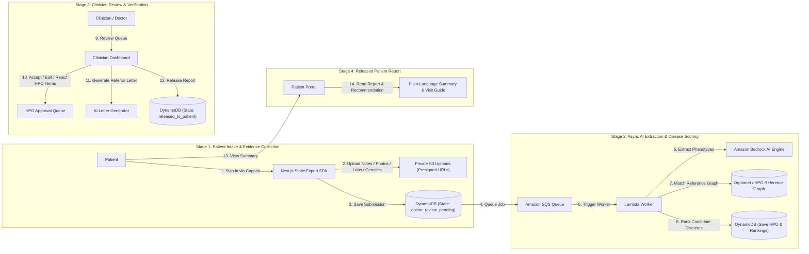

# Lumina Rare Disease SaaS — End-to-End System Architecture

## How Lumina Works: 4-Stage Functional Workflow

## AWS Services Mapped to Lumina Features

| Lumina Feature | Functional Purpose | AWS Serverless Backend Component |
| :--- | :--- | :--- |
| **Patient Portal & Intake Form** | Static web interface for patient intake, evidence upload, and status tracking. | **CloudFront + S3 (Web Bucket)** hosting static Next.js export assets. |
| **Secure Authentication** | Role-based login (`doctor` vs `patient`) with JWT token verification. | **Amazon Cognito Hosted UI & User Pools** issuing RS256 JWT tokens. |
| **Private Evidence Storage** | Direct browser-to-S3 upload for clinical notes, photos, lab reports, and VCF files. | **Amazon S3 (Uploads Bucket)** via temporary Presigned Put/Get URLs. |
| **Submission & Case Records** | Single-table persistence for submissions, message history, and case evaluations. | **Amazon DynamoDB** (`lumina-app`) with GSIs for patient ownership & review status. |
| **Background AI Processing** | Decoupled background queue for heavy document processing and scoring tasks. | **Amazon SQS Queue + Lambda Worker** running background processing. |
| **Phenotype & GenAI Extraction** | Extracts structured HPO terms and generates clinical referral letters. | **Amazon Bedrock** (Claude 3 Haiku / Nova Micro) with $0 `DEMO` fallback. |
| **Rare Disease Scoring Engine** | Ranks 6,000+ rare diseases against patient's extracted phenotypic profile. | **AWS Lambda + Read-Only Orphanet/HPO SQLite** graph matching engine. |
| **Clinician Referral Letter Generator** | Streamed markdown referral letter generation for medical genetics specialists. | **FastAPI on AWS Lambda** with AI provider abstraction. |
