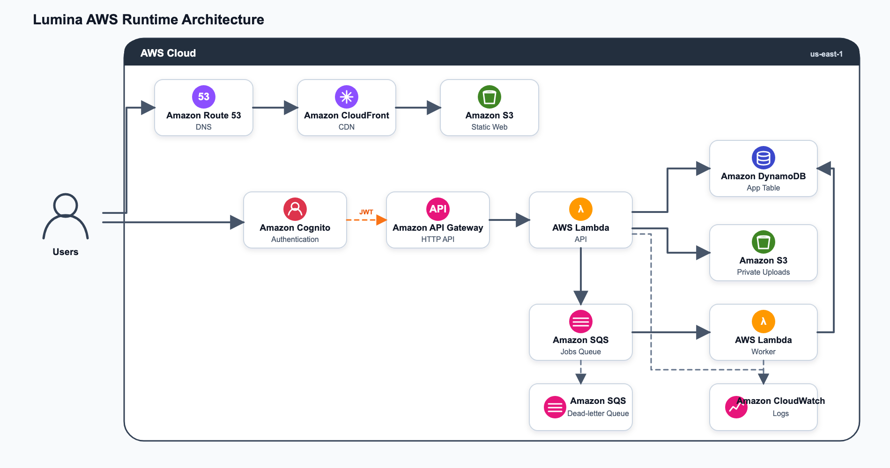

# Lumina AWS SaaS — Architecture Documentation

## AWS Enterprise Architecture

---

## Component & Dataset Responsibility Breakdown

| Service / Asset | Lumina Application Role & Location |
| :--- | :--- |
| Amazon CloudFront & S3 | Static Web SPA Hosting: Serves static HTML/JS/CSS export bundle globally (`apps/web/out`). |
| Amazon Cognito | User Login & Role Enforcement: Manages sign-in/sign-up and issues RS256 JWT tokens (`doctor` & `patient` groups). |
| Amazon API Gateway | HTTP API Gateway: Handles CORS, routing, and forwards Bearer tokens to Lambda. |
| AWS Lambda (FastAPI API) | Backend Business Logic: Verifies JWT claims, executes submission CRUD, case linking, and referral releases. |
| Amazon DynamoDB | Single-Table Application Database: Stores Submissions, Cases, Message History, and User Profiles (`PK`, `SK`, `GSI1`, `GSI2`). |
| Amazon S3 (Uploads Bucket) | Private Encrypted Medical Storage: Stores patient photos and lab PDFs accessed via short-lived Presigned URLs. |
| SQLite Reference DB | Orphanet & HPO Medical Knowledge Graph: Bundled read-only database (`orpha.sqlite`) containing 6,000+ rare disease profiles, HPO phenotype associations, and gene relationships directly inside the Lambda execution environment. |
| Amazon SQS Jobs Queue | Async AI Processing Queue: Decouples heavy AI document processing and scoring tasks. |
| AWS Lambda Worker | Background Execution: Consumes SQS records, invokes Bedrock AI, validates HPO IDs against local HPO graph, and writes results to DynamoDB. |
| Amazon Bedrock | GenAI Extraction Engine: Runs Claude 3 Haiku / Nova Micro for structured phenotype extraction with $0 default `DEMO` fallback. |
