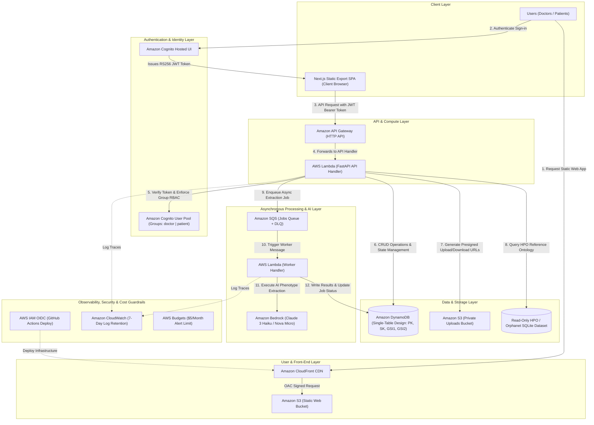

# Lumina SaaS — AWS Enterprise Architecture

## Architectural Data & Request Flow

## AWS Component Specifications

| Architecture Layer | AWS Service | Technical Role & Specification |
| :--- | :--- | :--- |
| **Front-End & CDN** | **Amazon CloudFront** | Global edge distribution serving static web bundle with Origin Access Control (OAC). |
| | **Amazon S3 (Web Bucket)** | Private S3 bucket hosting Next.js static export bundle (`apps/web/out`). |
| **Authentication** | **Amazon Cognito** | Hosted UI and User Pool managing OAuth flow and issuing RS256 signed JWT tokens with `doctor` and `patient` groups. |
| **API & Compute** | **Amazon API Gateway** | HTTP API Gateway with CORS support routing requests to serverless compute. |
| | **AWS Lambda (FastAPI)** | Serverless Python container executing FastAPI API logic, validating JWT claims, and managing submission lifecycle. |
| **Data & Storage** | **Amazon DynamoDB** | Single-table DynamoDB (`lumina-app`) storing Users, Submissions, Messages, Cases, and Jobs using `PK`, `SK`, `GSI1`, `GSI2`. |
| | **Amazon S3 (Uploads)** | Private bucket for patient photos and lab reports accessed exclusively via time-limited presigned URLs. |
| | **SQLite Reference DB** | Read-only Orphanet and HPO medical ontology graph packaged directly within Lambda environment. |
| **Async & AI** | **Amazon SQS** | Asynchronous job queue for background document processing + Dead Letter Queue (DLQ). |
| | **AWS Lambda (Worker)** | Event-driven SQS worker executing AI extraction, HPO validation, and scoring tasks idempotently. |
| | **Amazon Bedrock** | GenAI foundation model runtime (Claude 3 Haiku / Nova Micro) with a $0 fallback `DEMO` mode default. |
| **Governance & Security**| **AWS IAM & OIDC** | Least-privilege execution roles and keyless GitHub Actions OIDC deployment role. |
| | **Amazon CloudWatch** | Serverless log aggregation with 7-day retention to prevent storage bloat. |
| | **AWS Budgets** | Hard cost alert triggering email notifications if spending exceeds $5/month. |
