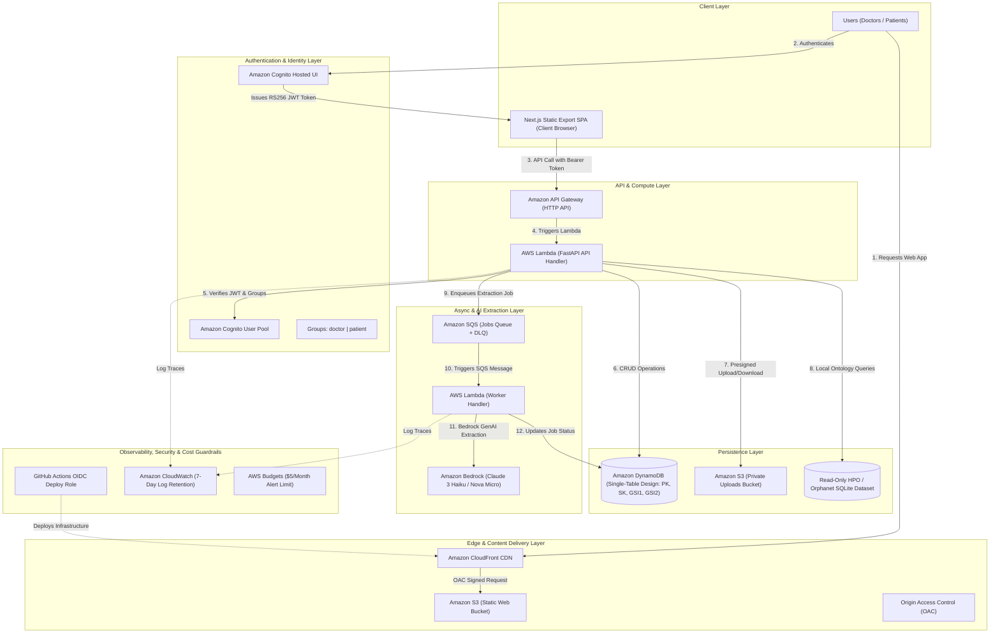

# Lumina AWS SaaS — Architecture Documentation

## Architecture Overview

## Architectural Layer Breakdown

| Layer | Service / Component | Purpose & Configuration |
| :--- | :--- | :--- |
| **Edge & CDN** | **Amazon CloudFront** | Delivers static Next.js export web assets globally with HTTPS and Origin Access Control (OAC). |
| | **Amazon S3 (Web Bucket)** | Private S3 bucket storing static HTML/JS/CSS exported assets (`apps/web/out`). |
| **Authentication** | **Amazon Cognito Hosted UI** | Handles user sign-in/sign-up OAuth flow, issuing RS256-signed JWT tokens. |
| | **Amazon Cognito User Pool** | Manages user identity and role assignment (`doctor` and `patient` groups). |
| **API & Compute** | **Amazon API Gateway** | HTTP API Gateway handling CORS, routing, and passing Authorization Bearer headers. |
| | **AWS Lambda (FastAPI API)** | Serverless Python container running FastAPI API. Verifies JWT claims and executes business logic. |
| **Persistence** | **Amazon DynamoDB** | Single-table DynamoDB (`lumina-app`) storing Users, Submissions, Messages, Cases, and Jobs (`PK`, `SK`, `GSI1`, `GSI2`). |
| | **Amazon S3 (Uploads Bucket)** | Private storage for uploaded patient photos and lab reports using presigned URLs (`tenant/default/users/{sub}/submissions/{id}/{kind}/{uuid}`). |
| | **SQLite Reference DB** | Read-only HPO and Orphanet medical ontology database packaged directly with Lambda. |
| **Async & AI** | **Amazon SQS** | Job queue for asynchronous AI extraction and scoring tasks + Dead Letter Queue (DLQ). |
| | **AWS Lambda (Worker)** | Event-driven SQS worker executing extraction jobs and updating DynamoDB status idempotently. |
| | **Amazon Bedrock** | GenAI foundation model runtime (Claude 3 Haiku / Nova Micro) with $0 default `DEMO` fallback mode. |
| **Security & Operations**| **GitHub Actions OIDC** | Keyless IAM deployment authorization using GitHub OIDC token assumption. |
| | **Amazon CloudWatch** | Serverless log aggregation with 7-day retention to prevent storage bloat. |
| | **AWS Budgets** | Hard cost alert triggering email notifications if spending exceeds $5/month. |
